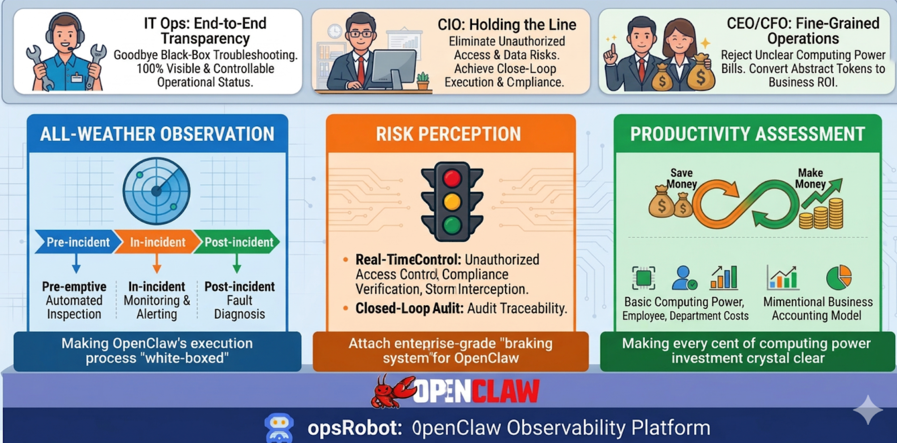

# OpenClaw Observability Platform

> English | [中文](./README_zh.md)

**OpenClaw Observability Platform**, developed based on the KWeaver Core framework, uses OTel protocol and eBPF technology for full-linkage tracing and monitoring of AI Agents. It provides rapid fault diagnosis, security compliance management, and lean computing operations capabilities to ensure high-quality growth of AI-powered businesses.

## Core Features & Business Value

### 24/7 Observability: Making OpenClaw Execution "White-Box"

- **Core Capability**: Build a comprehensive observation system providing lifecycle guarantees including pre-event (automated inspection), during-event (real-time monitoring & alerting), and post-event (precise fault diagnosis)
- **Business Value (for IT Ops)**: Full-process transparency, eliminating black-box troubleshooting, ensuring 100% visibility and control of system status

### Risk Perception: Enterprise-Grade "Brake System" for OpenClaw

- **Core Capability**: Establish robust security defenses covering real-time control (authorization management, compliance validation, storm blocking) and closed-loop auditing (audit traceability)
- **Business Value (for CIO)**: Maintaining system security baseline, eliminating unauthorized calls and data security risks, achieving a perfect closed loop between business execution and security compliance

### Productivity Assessment: Every Compute Investment Made Clear

- **Core Capability**: Based on multi-dimensional business accounting models, accurately decompose and track cost consumption across infrastructure computing, individual employees, and business departments
- **Business Value (for CEO/CFO)**: Drive refined operations, reject "confusing compute accounts", and intuitively convert abstract LLM Tokens into clear business ROI



## Architecture

```
┌─────────────────────────────────────────────────────────────────┐
│                    OpenClaw Observability Platform              │
├─────────────────────────────────────────────────────────────────┤
│                                                                 │
│  ┌──────────────┐    ┌──────────────┐    ┌──────────────────┐   │
│  │   Frontend   │    │  Backend API │    │  Apache Doris    │   │
│  │   (Vite+     │◄──►│  (Node.js)   │◄──►│  (OLAP Database) │   │
│  │   React)     │    │  Port: 8787  │    │  Port: 9030      │   │
│  │  Port: 3000  │    └──────────────┘    └──────────────────┘   │
│  └──────────────┘                                               │
│           ▲                                                     │
│           │                                                     │
│  ┌────────┴────────────────────────────────────────────────┐    │
│  │                  OTel  Data Pipeline                    │    │
│  │                                                         │    │
│  │  ┌─────────────┐   ┌─────────────┐   ┌──────────────┐   │    │
│  │  │   Sources   │──►│ Transform   │──►│    Sinks     │   │    │
│  │  │  (File/Exec)│   │  (Remap/    │   │ (HTTP to     │   │    │
│  │  │             │   │   Reduce)   │   │  Doris)      │   │    │
│  │  └─────────────┘   └─────────────┘   └──────────────┘   │    │
│  └────────────────────────────────────────────────────────-┘    │
│           ▲                                                     │
│           │                                                     │
│  ┌────────┴───────────────┐                                     │
│  │   OpenClaw Agent       │                                     │
│  │   Session Logs         │                                     │
│  │   (sessions.json /     │                                     │
│  │    *.jsonl)            │                                     │
│  └────────────────────────┘                                     │
└─────────────────────────────────────────────────────────────────┘
```

### Core Components

| Component | Tech Stack | Port | Description |
|-----------|------------|------|-------------|
| **Frontend** | React 18 + Vite + Tailwind CSS | 3000 | Observability Web UI |
| **Backend API** | Node.js | 8787 | RESTful API service for data queries |
| **Database** | Apache Doris | 9030 (MySQL) / 8040 (BE) | OLAP analytics database for session and log storage |
| **Data Pipeline** | Vector | - | Data collection, transformation, and ingestion pipeline |
| **Data Source** | OpenClaw Agent | - | AI Agent runtime, source of log output |

---

## Features

### 1. Security Audit

| Module | Description |
|--------|-------------|
| **Audit Overview** | Core security metrics, risk statistics, real-time situational awareness, trends and rankings |
| **Configuration Changes** | History of critical configuration changes with multi-dimensional filtering by source, event type, and configuration path |
| **Session Audit** | OpenClaw session indexing, model usage, and Token consumption compliance logging |

### 2. Cost Analysis

| Module | Description |
|--------|-------------|
| **Cost Overview** | Total cost, daily average consumption, multi-dimensional proportion analysis, and trend charts |
| **Agent Cost List** | Per-Agent total consumption, average cost per task, call volume, and success rate statistics |
| **LLM Cost Details** | Token usage and cost details by model dimension |

---

## How It Works

```
┌─────────┐    ┌───────────────────┐    ┌─────────────────┐    ┌─────────────────┐
│OpenClaw │───►│ Vector Pipeline   │───►│ Apache Doris    │◄───│    Frontend     │
│ Agent   │    │ (Data Collection  │    │ (Storage &      │    │ (Visualization) │
│ Logs    │    │  & Transformation)│    │  Analytics)     │    │                 │
└─────────┘    └───────────────────┘    └─────────────────┘    └────────┬────────┘
                                                                        │
                                           ┌─────────────────┐          │
                                           │   Backend API   │◄─────────┘
                                           │   (Node.js)     │
                                           │   Port: 8787    │
                                           └─────────────────┘
```

## Online Live Demo

Try it out now! Access the live demo at:

- **URL**: http://nw1pe2061132.vicp.fun/
- **Password**: aishu.cn

### Prerequisites

- Docker Desktop
- Node.js 18+

### Method 1: Docker Compose - Image Deployment (Recommended)

```bash
docker compose -f docker-compose.yml up -d
```

### Method 2: Docker Compose - Build & Deploy

```bash
# Build and start all services from source
docker compose up -d

# Or use the build compose file
docker compose -f docker-compose-build.yml up -d
```

#### Doris Data Persistence

To ensure data persistence, Doris data is stored in `~/var/doris_data` by default. If this directory doesn't exist, create it:

```bash
mkdir -p ~/var/doris_data
```

To change the data directory path, modify the `volumes > doris_data` configuration in `docker-compose-build.yml`.

By default, Doris will be reinitialized on each deployment (historical data will be cleared). To preserve data:

```bash
# Use local historical data
DORIS_USE_LOCAL_DATA=true docker compose -f docker-compose-build.yml up -d
```

| `DORIS_USE_LOCAL_DATA` | Behavior |
|------------------------|----------|
| `false` (default) | Clear all data and reinitialize on each deployment |
| `true` | Preserve and use local historical data from `./doris-data` |

After services start, access:

| Service | URL |
|---------|-----|
| Frontend UI | http://localhost:3000 |
| Doris FE | http://localhost:8030 |

### Method 3: Local Development

```bash
# Install dependencies
npm install

# Start backend API (port 8787)
npm run api

# In a separate terminal, start frontend dev server (port 3000)
npm run dev
```

### Vector Configuration

Vector acts as the log collector for OpenClaw. It needs to be installed and configured on each machine running OpenClaw. The OpenClaw Observability Platform supports multiple Vector collectors to aggregate log data from multiple OpenClaw instances.

Modify the data source paths in `vector.yaml` to point to your actual OpenClaw log directory:

```yaml
sources:
  sessions:
    command: ["cat", "/path/to/openclaw/sessions/sessions.json"]

  session_logs:
    include:
      - "/path/to/openclaw/agents/*/sessions/*.jsonl"

  gateway_logs:
    include:
      - "/path/to/openclaw/logs/gateway.log"
      - "/path/to/openclaw/logs/gateway.err.log"

  audit_logs:
    include:
      - "/path/to/openclaw/logs/config-audit.jsonl"
```

#### Vector Installation (macOS)

```bash
brew tap vectordotdev/brew && brew install vector
```

#### Start Vector

```bash
vector --config vector.yaml
```

---

## Environment Variables

| Variable | Default | Description |
|----------|---------|-------------|
| `DORIS_HOST` | doris | Doris hostname |
| `DORIS_PORT` | 9030 | Doris MySQL port |
| `DORIS_USER` | root | Database username |
| `DORIS_PASSWORD` | (empty) | Database password |
| `DORIS_DATABASE` | opsRobot | Database name |
| `API_PORT` | 8787 | Backend API port |
| `FRONTEND_PORT` | 3000 | Frontend port |
| `DORIS_USE_LOCAL_DATA` | false | Whether to preserve Doris historical data across redeployments. `false` = reinitialize (default), `true` = use local data |

---

## Version Compatibility

This project closely follows the development of the OpenClaw community. It has been developed, validated, and tested based on the latest version of OpenClaw. For accurate collection and display of observability metrics, it is recommended to use in the following environment:

| Component | Recommended Version | Description |
|-----------|---------------------|-------------|
| OpenClaw | latest (v3.x+) | Core scheduling and management platform |
| Linux Kernel | 4.18+ | Minimum kernel requirement for eBPF probes |
| Docker | 20.10.0+ | Recommended container runtime environment |
| Docker Compose | v2.0.0+ | Recommended for local fast orchestration |

---

## Community

We welcome and encourage contributions in any form! Whether submitting bug reports, improving documentation, or submitting PRs for core code, all contributions are greatly appreciated.

- **Contributing Guide**: Please read our [CONTRIBUTING.md](./CONTRIBUTING.md) to learn how to get started.
- **WeChat Community**: Scan the QR code below to join the WeChat community for discussions:


---

## License

This project is licensed under the [Apache License 2.0](LICENSE).
