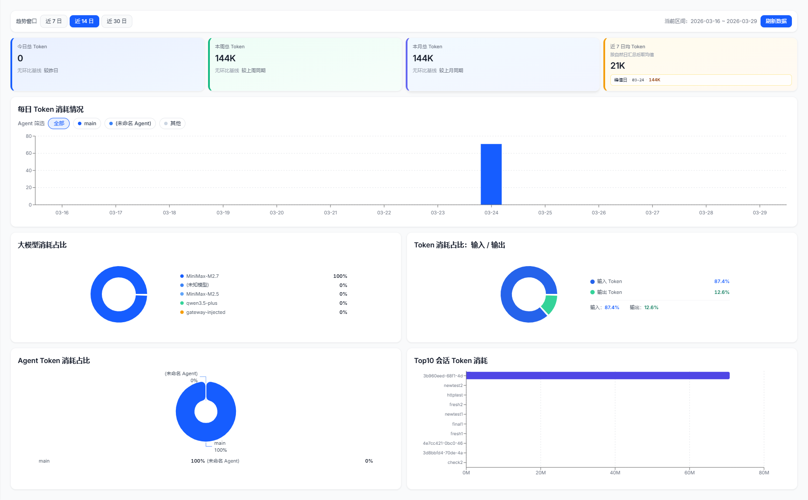
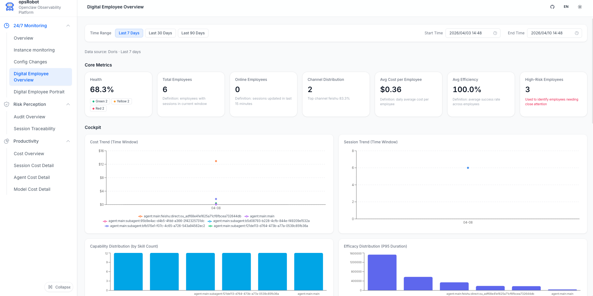
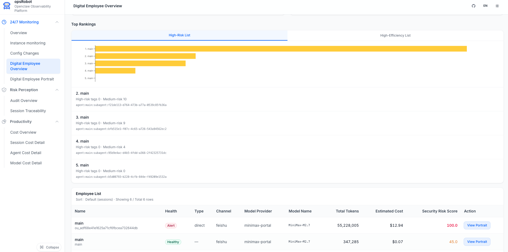
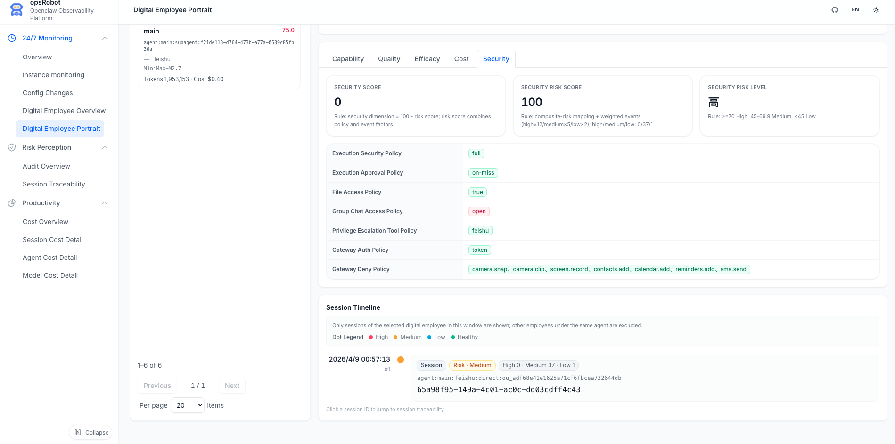
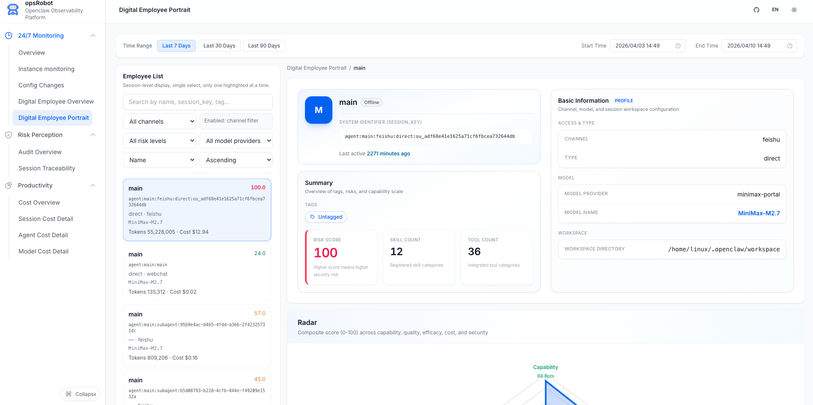

# OpenClaw 可观测性平台

**OpenClaw 可观测性平台**，基于 KWeaver Core 框架开发，使用 OTel 协议、eBPF 技术对智能体进行全链路追踪与监管，提供故障快速排查、安全合规管控及算力精益运营的管理能力，护航 AI 赋能业务的高质量增长。

## 核心特性与业务价值

### 全天候观测：让 OpenClaw 的执行过程“白盒化”

- **核心能力**： 构建贯穿全局的观测体系，提供事前（预前自动巡检）、事中（实时监控告警）、事后（精准故障排查）的全生命周期保障。
- **业务价值 (赋能 IT 运维)**：全流程透明，彻底告别黑盒排障，确保系统运行状态 100% 可视可控。

### 风险感知：为 OpenClaw 挂载企业级“刹车系统”

- **核心能力**：建立坚固的安全防线，涵盖实时控制（越权管控、合规校验、风暴拦截）与闭环审计（审计溯源）两大核心机制。
- **业务价值 (赋能 CIO)**：坚守系统底线，消除越权调用与数据安全隐患，实现业务执行与安全合规的完美闭环。

### 可管理的成本：让每一分算力投资都清清楚楚
- **核心能力**：依托多维业务核算模型，精准拆解并追踪基础算力、员工个体及业务部门维度的费用消耗情况。
- **业务价值 (赋能 CEO / CFO)**：驱动精细化运营，拒绝算力“糊涂账”，将抽象的大模型 Token 直观转化为清晰的业务 ROI。


## 项目架构

```
┌─────────────────────────────────────────────────────────────────┐
│                    OpenClaw Observability Platform              │
├─────────────────────────────────────────────────────────────────┤
│                                                                 │
│  ┌──────────────┐    ┌───────────────┐    ┌───────────────────┐ │
│  │   Frontend   │    │  Backend API  │    │  Apache Doris     │ │
│  │   (Vite+     │◄──►│  (Node.js)    │◄──►│  (OLAP Database)  │ │
│  │   React)     │    │  Port: 8787   │    │  Port: 9030       │ │
│  │  Port: 3000  │    └───────────────┘    └───────────────────┘ │
│  └──────────────┘                                               │
│                                                ▲                │
│                                                │                │
│  ┌─────────────────────────────────────────────┴───────────┐    │
│  │                  OTel  Data Pipeline                    │    │
│  │                                                         │    │
│  │  ┌─────────────┐   ┌──────────────┐   ┌───────────────┐ │    │
│  │  │   Sources   │──►│   Transform  │──►│    Sinks      │ │    │
│  │  │  (File/Exec)│   │(Remap/Reduce)│   │(HTTP to Doris)│ │    │
│  │  │             │   │              │   │               │ │    │
│  │  └─────────────┘   └──────────────┘   └───────────────┘ │    │
│  └─────────────────────────────────────────────────────────┘    │
│           ▲                                                     │
│           │                                                     │
│  ┌────────┴───────────────┐                                     │
│  │   OpenClaw Agent       │                                     │
│  │   Session Logs         │                                     │
│  │   (sessions.json /     │                                     │
│  │    *.jsonl)            │                                     │
│  └────────────────────────┘                                     │
└─────────────────────────────────────────────────────────────────┘
```

### 核心组件

| 组件 | 技术栈 | 端口 | 说明 |
|------|--------|------|------|
| **Frontend** | React 18 + Vite + Tailwind CSS | 3000 | 可观测性 Web 界面 |
| **Backend API** | Node.js | 8787 | RESTful API 服务，提供数据查询接口 |
| **Database** | Apache Doris | 9030 (MySQL) / 8040 (BE) | OLAP 分析数据库，存储会话与日志数据 |
| **Data Pipeline** | Vector | - | 数据采集、转换与写入管道 |
| **Data Source** | OpenClaw Agent | - | AI Agent 运行时，日志输出源 |

---


## 在线体验

立即体验！

- **地址**: https://opsrobot-demo.aishu.cn:3000/


## 快速开始

### 1.环境要求

- Docker Desktop 及 Docker Compose 插件
- Node.js 18+

### 2.克隆项目

```bash
https://github.com/opsrobot-ai/opsrobot.git
cd opsrobot
```

### 3.基于镜像部署后台服务

```bash
docker compose -f docker-compose.yml up -d
```

服务启动后访问：http://localhost:3000


### 4.配置 OpenClaw 数据采集

**说明：在每个 OpenClaw 运行的机器上安装配置采集器vector**
[vector官网](https://vector.dev/docs/)  [vector 安装说明](https://vector.dev/docs/setup/installation/)

#### MacOS 环境的采集器安装：

```bash
brew tap vectordotdev/brew && brew install vector
```

#### Linux 环境的采集器安装：

CentOS 系统使用 yum 命令安装：
```bash
bash -c "$(curl -L https://setup.vector.dev)"
sudo yum install vector
```

Ubuntu 系统使用 apt-get 命令安装：
```bash
bash -c "$(curl -L https://setup.vector.dev)"
sudo apt-get install vector
```

#### 修改 `vector.yaml` 采集配置文件：
[vector配置文档](https://vector.dev/docs/reference/configuration/)
指向后端服务器 IP 地址（如果与 OpenClaw 在同一台服务中，无需修改）：
```yaml
sinks:
  session_to_doris: &sink_template
    uri: "http://127.0.0.1:8040/api/opsRobot/agent_sessions/_stream_load"

  session_logs_to_doris:
    uri: "http://127.0.0.1:8040/api/opsRobot/agent_sessions_logs/_stream_load"

  gateway_logs_to_doris:
    uri: "http://127.0.0.1:8040/api/opsRobot/gateway_logs/_stream_load"

  audit_logs_to_doris:
    uri: "http://127.0.0.1:8040/api/opsRobot/audit_logs/_stream_load"

  openclaw_config_to_doris:
    uri: "http://127.0.0.1:8040/api/opsRobot/openclaw_config/_stream_load"

  agent_models_to_doris:
    uri: "http://127.0.0.1:8040/api/opsRobot/agent_models/_stream_load"

```

指向实际的 OpenClaw 日志目录，实现日志采集监听：
```yaml
sources:
  sessions:
    command: 
      - "sh"
      - "-c"
      - 'for f in ~/.openclaw/agents/*/sessions/sessions.json; do if [ -f "$$f" ]; then tr -d "\n" < "$$f"; echo ""; fi; done'

  session_logs:
    include:
      - "~/.openclaw/agents/*/sessions/*.jsonl"

  gateway_logs:
    include:
      - "~/.openclaw/logs/gateway.log"
      - "~/.openclaw/logs/gateway.err.log"

  audit_logs:
    include:
      - "~/.openclaw/logs/config-audit.jsonl"

  openclaw_config_file:
    command:
    - "sh"
    - "-c"
    - 'f="~/.openclaw/openclaw.json"; if [ -f "$$f" ]; then j=$$(tr -d "\n" < "$$f"); printf "{\"source_path\":\"%s\",\"openclaw_root\":%s}\n" "$$f" "$$j"; fi'

  agent_models_file:
    command:
    - "sh"
    - "-c"
    - 'for f in ~/.openclaw/agents/*/agent/models.json; do if [ -f "$$f" ]; then agent=$$(basename "$$(dirname "$$(dirname "$$f")")"); [ -z "$$agent" ] && continue; j=$$(tr -d "\n" < "$$f"); printf "{\"source_path\":\"%s\",\"agent_name\":\"%s\",\"models_root\":%s}\n" "$$f" "$$agent" "$$j"; fi; done'

  cron_jobs_config_file:
    type: exec
    command: 
      - "sh"
      - "-c"
      - 'for f in ~/.openclaw/cron/jobs.json; do if [ -f "$$f" ]; then tr -d "\n" < "$$f"; echo ""; fi; done'

  cron_runs_config_file:
    type: file
    include:
    - "~/.openclaw/cron/runs/*.jsonl"
    read_from: beginning
    fingerprint:
      strategy: device_and_inode
```

#### 启动 Vector 采集器服务：

```bash
vector --config vector.yaml
```
### 5.配置 OpenClaw-Diagnostics-Otel 数据采集

* [官方文档介绍](https://docs.openclaw.ai/zh-CN/logging)

在openclaw.json文件需要增加或者修改配置如下：
```yaml
{
  "diagnostics": {
    "enabled": true,
    "otel": {
      "enabled": true,
      "endpoint": "http://192.168.72.87:4318",
      "traces": true,
      "metrics": true,
      "logs": true,
    },
    "cacheTrace": {
      "enabled": true,
      "includeMessages": true,
      "includePrompt": true,
      "includeSystem": true
    }
  },
  "plugins": {
    "entries": {
      "diagnostics-otel": {
        "enabled": true
      },
    },
    "allow": [
      "diagnostics-otel",
    ]
  }
}
```
修改配置完成后，需要 重启openclaw：
```bash
openclaw gataway restart
```

### 6.查看 OpenClaw 的所有观测数据：

* 在 OpenClaw 界面进行对话互动
* 在 opsRobot 产品界面中查看采集数据：http://localhost:3000

## 更多截图
会话溯源分析：


Token 消耗看板：


数字员工模块（概览与画像）：







## 版本兼容性
本项目紧随 OpenClaw 社区的发展，目前已基于 OpenClaw 最新版本 完成了开发、功能验证及稳定性测试。为确保各项可观测性指标的准确抓取与展示，建议在以下环境中使用：

| 组件 | 推荐版本 | 说明 |
|------|----------|------|
| OpenClaw | latest (v3.x+) | 核心调度与管理平台 |
| Linux Kernel | 4.18+ | eBPF 探针运行的最低内核要求 |
| Docker | 20.10.0+ | 推荐容器运行时环境 |
| Docker Compose | v2.0.0+ | 推荐用于本地快速编排验证 |


## 参与贡献与社区：
我们欢迎并鼓励任何形式的贡献！无论是提交 Bug 反馈、完善文档，还是提交核心代码的 PR，都是对 opsRobot 开源社区的巨大支持。
贡献指南: 请阅读我们的 [CONTRIBUTING.md 链接] 了解如何开始。
社区交流:微信交流群二维码


## 微信交流群

扫描下方二维码加入微信交流群：


---


## License

[Apache License 2.0](LICENSE)
