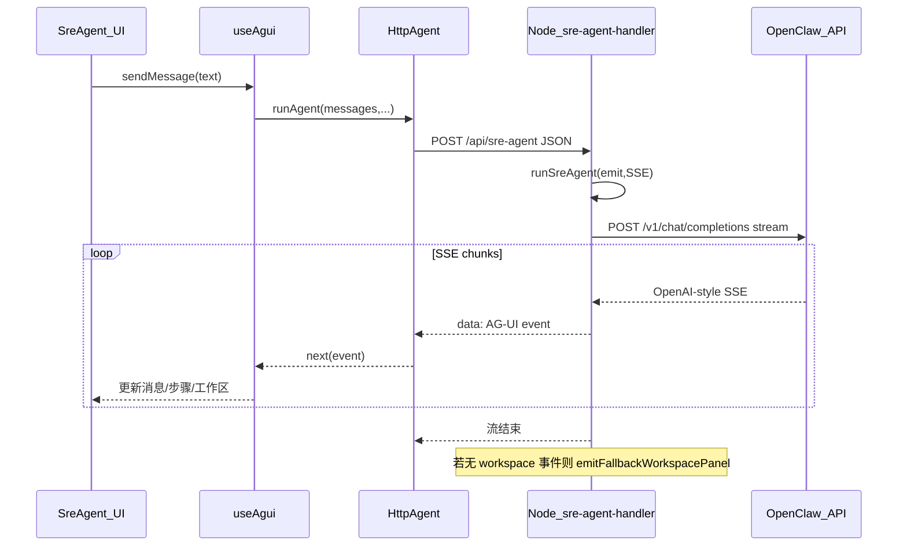
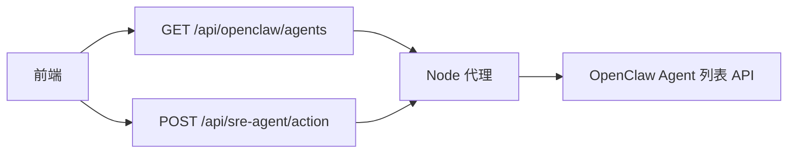

# SRE Agent 执行架构

本文描述本仓库中 **SRE Agent** 从浏览器到 OpenClaw 的请求路径、协议与组件职责（基于当前实现）。

---

## 1. 分层总览

| 层级 | 职责 |
|------|------|
| **前端 UI** | `frontend/pages/SreAgent.jsx`：左侧对话、Agent 选择、思考链、Markdown；`WorkspaceRenderer`：右侧工作区面板 |
| **AG-UI 客户端** | `frontend/lib/agui.js` 中 `HttpAgent`：`POST /api/sre-agent`，读取 **SSE**，解析为 AG-UI 事件 |
| **状态机** | `frontend/lib/useAgui.js`：将事件聚合为 `messages` / `steps` / `workspacePanels` / `agentState` 等 |
| **Node 桥接** | `backend/sre-agent/sre-agent-handler.mjs`：HTTP → SSE；`backend/sre-agent/openclaw-client.mjs` 中 `runSreAgent` |
| **OpenClaw** | `POST {OPENCLAW_API_URL}/v1/chat/completions`（流式）；可选 `GET` 系列路径列举 Agent（由 `handleListAgents` 代理） |

前后端之间使用 **AG-UI 事件流**，经 **Server-Sent Events (SSE)** 传输；后端将 OpenClaw 的 **Chat Completions 流式响应** 翻译为 AG-UI 事件。

---

## 2. 主路径：发送一条用户消息

### 要点

1. **请求体**（`HttpAgent`）：包含 `agentId`（前端所选 OpenClaw Agent）、`threadId`、`messages` 等。
2. **`runSreAgent`**：依次发出 `RUN_STARTED`、`STEP_STARTED` 等；调用 `callOpenClawStream`，再经 `processStreamResponse` 将 token / tool 等转为 `TEXT_MESSAGE_*`、`TOOL_CALL_*`、`CUSTOM` 等事件。
3. **内置 Agent vs 外部 Agent**：当 `agentId !== "sre-agent"` 时，**不注入** 本地 `SYSTEM_PROMPT` / `SRE_TOOLS`，完全使用 OpenClaw 侧已配置的技能与提示。
4. **调用 OpenClaw**：使用 `Authorization: Bearer`、`X-OpenClaw-Agent-Id`、请求体中的 `agent_id` 等，与 OpenClaw Chat API 约定一致。

---

## 3. 事件与 UI 映射（概念）

| AG-UI 事件类型 | 前端表现 |
|----------------|----------|
| `RUN_STARTED` / `RUN_FINISHED` / `RUN_ERROR` | 运行状态、错误提示 |
| `STEP_STARTED` / `STEP_FINISHED` | 左侧「Agent 思考过程」可展开步骤 |
| `TEXT_MESSAGE_*` | 助手气泡（Markdown，如 `@ant-design/x-markdown`） |
| `TOOL_CALL_*` | 工具调用指示器 |
| `CUSTOM`（`workspace` / `surfaceUpdate` / `dataModelUpdate`） | 右侧工作区面板、A2UI 表面与数据模型 |

若流式结束后仍无结构化 workspace 事件，后端会执行 **`emitFallbackWorkspacePanel`**：从累积文本解析表格、代码块、A2UI 块，以及可选的指标/Pod 等实时面板。

---

## 4. 辅助 HTTP 接口

| 方法 | 路径 | 说明 |
|------|------|------|
| GET | `/api/openclaw/agents` | 与 `GET /api/sre-agent/agents` **等价**，拉取 OpenClaw 已注册 Agent 列表（供下拉框） |
| POST | `/api/sre-agent/action` | A2UI 用户操作上报（当前多为日志/占位） |

---

## 5. 环境与部署要点

- **开发**：Vite 插件 `vite-plugins/agentSessionsDevApi.mjs` 将 `/api/*` 路由到上述 handler；根目录 `.env` 通过 `vite.config.js`（`loadEnv`）与 `backend/env-bootstrap.mjs` 注入 `OPENCLAW_API_URL`、`OPENCLAW_API_KEY`、`OPENCLAW_AGENT_ID`、`OPENCLAW_MODEL` 等。
- **预览 / 独立 API**：`node backend/serveAgentSessionsApi.mjs`（默认端口见 `PORT`，常为 8787）；`vite.config.js` 中 `preview.proxy` 可将 `/api` 转发到该服务。
- **容器 / Nginx**：示例见仓库根目录 `nginx.conf`，将 `/api/sre-agent` 等代理到后端并保持 SSE 相关头与缓冲关闭。

---

## 6. 相关源码路径（速查）

| 模块 | 路径 |
|------|------|
| 页面 | `frontend/pages/SreAgent.jsx` |
| AG-UI 客户端 | `frontend/lib/agui.js` |
| 事件归约 | `frontend/lib/useAgui.js` |
| Agent 列表（前端） | `frontend/lib/sreAgentCatalog.js` |
| HTTP + SSE | `backend/sre-agent/sre-agent-handler.mjs` |
| OpenClaw 流与兜底面板 | `backend/sre-agent/openclaw-client.mjs` |
| 开发中间件 | `vite-plugins/agentSessionsDevApi.mjs` |
| 独立 HTTP 服务 | `backend/serveAgentSessionsApi.mjs` |

---

## 7. 一句话归纳

**SRE Agent 执行架构 = 浏览器以 AG-UI 语义经 SSE 连接本仓库 Node 桥接层，桥接层将 OpenClaw 流式 Chat API 转为 AG-UI 事件，并可在无结构化 workspace 时从纯文本生成工作区面板；对话目标 Agent 由前端 `agentId` 与环境默认 `OPENCLAW_AGENT_ID` 共同决定。**
