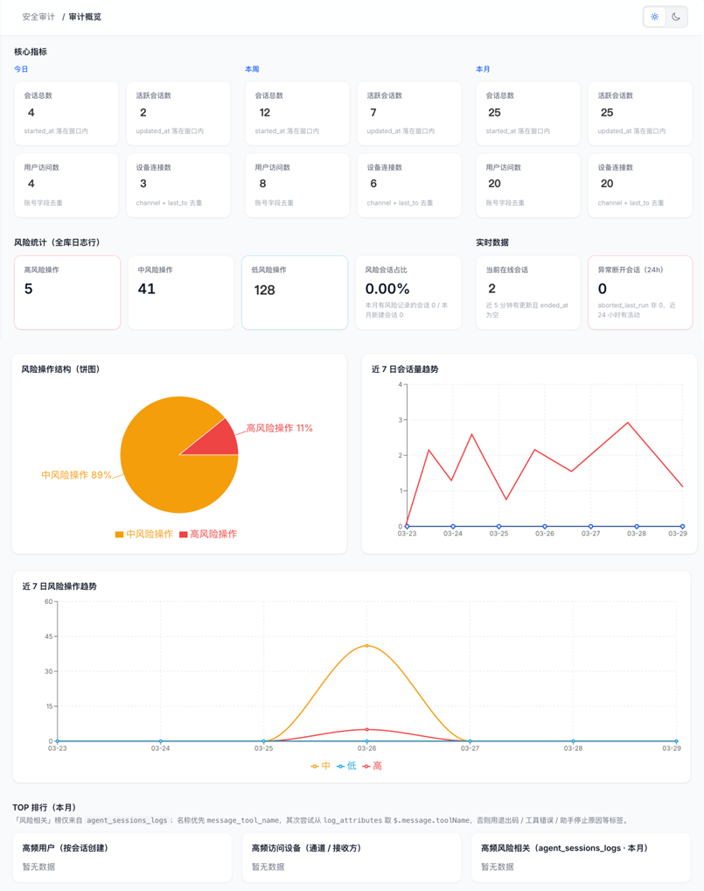
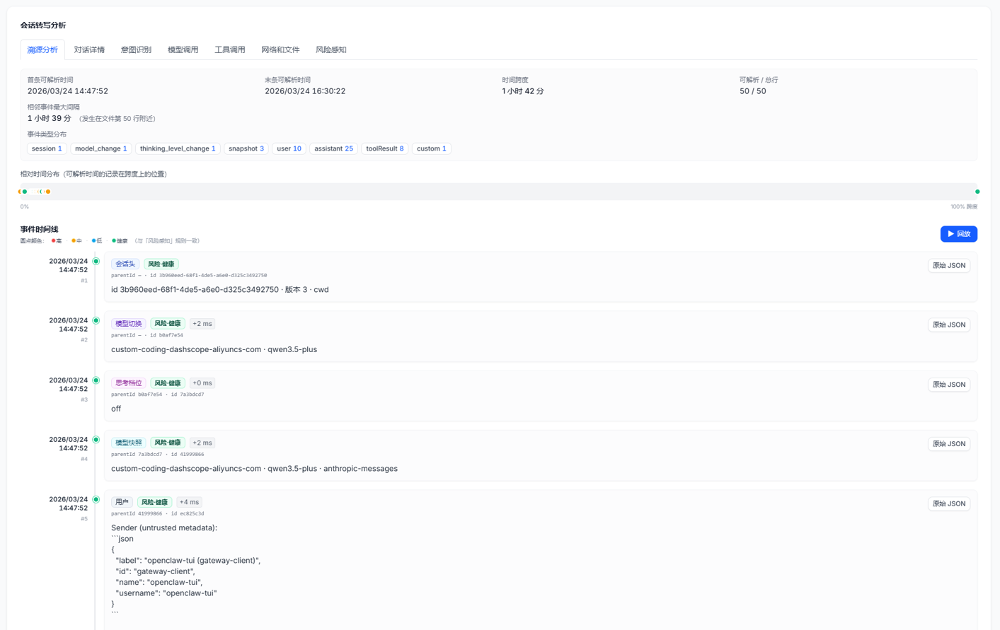
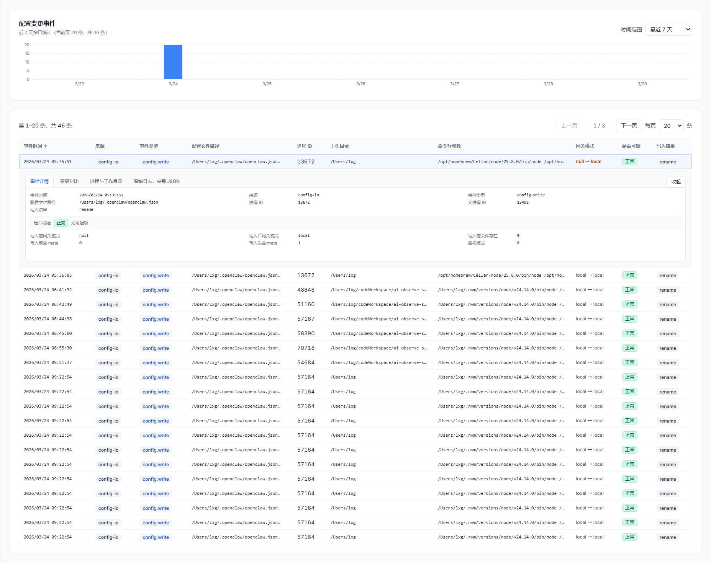

# OpenClaw Observability Platform 文档指南

欢迎阅读 **OpenClaw Observability Platform (OpenClaw 可观测性平台)** 官方文档。

**OpenClaw 可观测性平台**基于 KWeaver Core 框架开发，使用 OTel 协议对智能体进行全链路追踪与监管，提供故障快速排查、安全合规管控及算力精益运营的管理能力，护航 AI 赋能业务的高质量增长。

---

## 核心特性与业务价值

### 全天候观测：让 OpenClaw 的执行过程“白盒化”
- **核心能力**：构建贯穿全局的观测体系，提供事前（预前自动巡检）、事中（实时监控告警）、事后（精准故障排查）的全生命周期保障。
- **业务价值 (赋能 IT 运维)**：全流程透明，彻底告别黑盒排障，确保系统运行状态 100% 可视可控。

### 风险感知：为 OpenClaw 挂载企业级“刹车系统”
- **核心能力**：建立坚固的安全防线，涵盖实时控制（越权管控、合规校验、风暴拦截）与闭环审计（审计溯源）两大核心机制。
- **业务价值 (赋能 CIO)**：坚守系统底线，消除越权调用与数据安全隐患，实现业务执行与安全合规的完美闭环。

### 生产力评估：让每一分算力投资都清清楚楚
- **核心能力**：依托多维业务核算模型，精准拆解并追踪基础算力、员工个体及业务部门维度的费用消耗情况。
- **业务价值 (赋能 CEO / CFO)**：驱动精细化运营，拒绝算力“糊涂账”，将抽象的大模型 Token 直观转化为清晰的业务 ROI。

---

## 📖 文档导航

请根据您的使用场景选择对应的参考指南：

### 🚀 快速起步
协助您快速完成本地服务部署和日志接入。

- **[👉 快速入门篇](./getting-started/quick-start.md)**：包含前置依赖说明、本地运行步骤及面板初探。
- **[👉 部署与架构拓扑](./getting-started/deployment.md)**：介绍如何安装 `Vector` 进行日志采集并对接数据库。

### 🧩 核心功能

- **[👉 全天候观测：系统概览与实例监控](./features/system-monitoring.md)**：提供跨节点的实时基础设施探针，统揽大模型业务连接、吞吐队列性能与网关实例健康度。
- **[👉 风险感知：审计概览看板](./features/audit-dashboard.md)**：提供 OpenClaw 的实时监控仪表盘，实现安全状态可视化、可感知，为运维团队提供全局安全视角。

- **[👉 会话与溯源追踪](./features/session-tracing.md)**：针对 OpenClaw 会话提供全链路溯源，从溯源分析、会话过程、对话详情、意图识别、模型调用、工具调用、网络和文件操作等多个维度，对会话进行深度剖析，实现会话全生命周期可追溯。精准还原 OpenClaw 执行全过程，帮助开发者快速定位交互异常、工具调用错误等问题根源。

- **[👉 配置变更审计](./features/config-audit.md)**：追踪和审计 AI Agent 配置变更行为，实现配置变更可追溯、可审计，防范配置异常带来的安全风险。

- **[👉 生产力核算：成本分析账单](./features/cost-analysis.md)**：提供 Token 消耗的整体监控和分析仪表盘，直观呈现 Token 消耗全局态势，为成本管控提供数据支撑。

### 🏗️ 架构参考
解析底层数据收集和清洗机制。

- **[👉 OTel 数据流水线](./architecture/data-pipeline.md)**：数据采集引擎设计与异步架构方案说明。

### 💻 开发者贡献指引
查阅本地开发及源码调试要求。

- **[👉 开发指南与环境构建](./development/local-setup.md)**：环境变量及前后端启动项说明。

---

> GitHub 官方仓库: [https://github.com/aishu-opsRobot/openclaw-observability-platform](https://github.com/aishu-opsRobot/openclaw-observability-platform)
