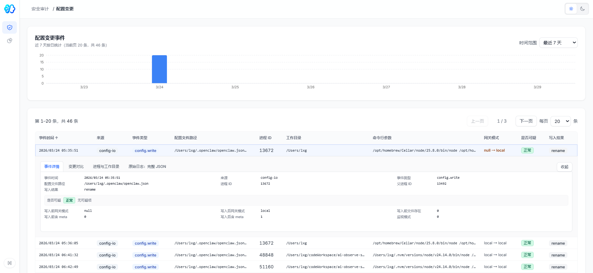

# 特权与配置变更审计 (Config Audit)

当 AI Agent 拥有系统级工具调用权限（如 Shell 执行、文件读写 API）时，追踪其对基础环境的变更操作是保障合规与安全的重要环节。

配置变更审计用于记录数字员工在操作系统层面的敏感写操作及权限使用情况。

---

## 🌟 核心价值

使数字员工引发的系统状态变更留存绝对的“不可否认”证据链。当服务器环境出现配置异常或文件丢失时，运维人员无需手动查询底层命令历史，可通过审计面板直接获取其底层 API 调用的修改记录，降低核心服务被其误清理的风险。

## 🛡️ 主要审计维度

### 1. 追踪敏感文件与配置的修改

基于定制监控采集，当应用的执行动作涉及系统核心路径时，会生成审计记录并可视化呈现：
- **时间趋势与时效搜索**：提供最近 7 天配置变更事件的柱状频次图。
- **关联进程特征提取**：列表中明确标注每个变更写入事件的**事件类型**（如 `config.write`）、**触发来源**（如 `config-io`）、**目标文件绝对路径**、**操作进程 ID (PID)**、**进程执行所在同名录 (Workdir)**。
- 重点关注的对象通常涵盖：
  - 系统网络配置：如更改 `/etc/hosts`、`/etc/resolv.conf` 等。
  - 权限与凭证管理：如读取或写入 `~/.ssh/authorized_keys`。
  - 程序运行核心目录：如对全局级 `node_modules` 或是类似 `/opt/homebrew` 路径的内容变更。

### 2. 状态差异比对分析 (Diff & Trace)

平台不仅记录了有改动发生的“事实”，同时也支持下钻深究修改内容。

**展开记录详情查验**
- **网关穿透情况**：面板解析写操作的网关模式（`Gateway Mode`），记录写操作是否是由隔离环境穿透回宿主机的，例如 `null -> local` 或 `local -> local`，提示可能的越权行为级别。
- **文件状态溯源**：查验修改操作时该文件是否存在，是覆盖写入（`overwrite`）、重命名（`rename`）抑或追加变更。

如果数字员工执行了针对 `yaml`/`json` 或其他配置文件的关键修正操作，平台提供额外的标签页如 `变更对比` 进行 Diff 核对，以及调出 `原始日志：完整 JSON` 进行运维对接，协助管理员清晰核查每次操作所造成的环境实际变更及底层系统参数。
