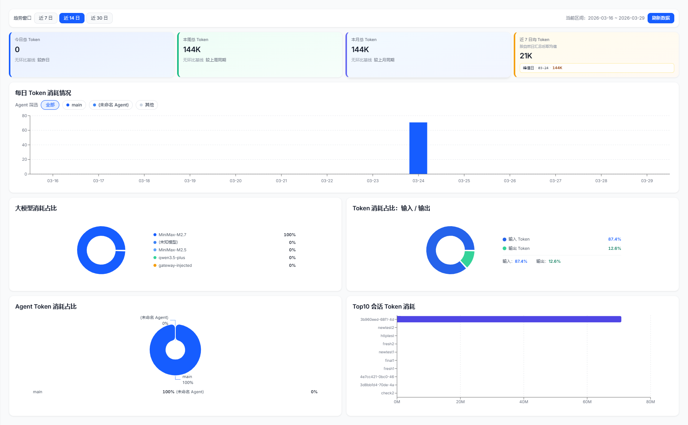

# 消费账单与成本分析 (Cost Center)

在企业内部规模化应用大语言模型（LLM）时，准确核算和拆解 API 调用成本是关键的管理需求。

成本看板主要用于将聚合的模型 API 开支转化为清晰、可追踪的业务账单。提供多维度视角的 Token 消耗度量与统计。

---

## 🌟 核心价值与能力

### 1. 全局消耗趋势与概览 (Overview)
利用多时间窗（今日、本周、本月及自定义区间）的指标卡及可视化柱状图，展示大模型 Token 消耗的每日趋势。同时，在概览页直观展示四大核心指标：
- **大模型消耗占比 (Model Distribution)**：对比 `MiniMax`、`qwen3.5` 等不同底层模型的请求比例。
- **输入/输出消耗占比 (I/O Ratio)**：精确区分 Input 与 Output Token 的占比态势。
- **Agent Token 消耗占比 (Agent Breakdown)**：统计不同智能体节点的消耗比例。
- **Top 10 会话消耗 (Top Sessions)**：快速定位最昂贵的交互会话。

### 2. 多维度成本细化拆解
系统在左侧侧边栏提供更多维的账单切面查看，支持细粒度归因：
- **Agent 成本明细**：追踪具体哪些数字员工或代码流程消耗了最多的计算资源。
- **LLM 成本明细**：跨平台对账，将不同供应商（如 OpenAI、Anthropic、本地模型等）的成本数据统一聚合统计。
- **会话成本明细**：落到具体的业务 Session，便于追查某些因死循环或异常逻辑引发的海量浪费。

> **最佳实践 (Best Practice) 👉 优化模型调用效率**
> 管理员可结合会话耗时等指标，筛查出“高消耗、高耗时”或是“消耗大量 Token 但最终仅产生报错”的异常调用链路。通过优化系统 Prompt 层级和调用逻辑，可以有效防范类似 API 风暴引发的高额账单事件。
