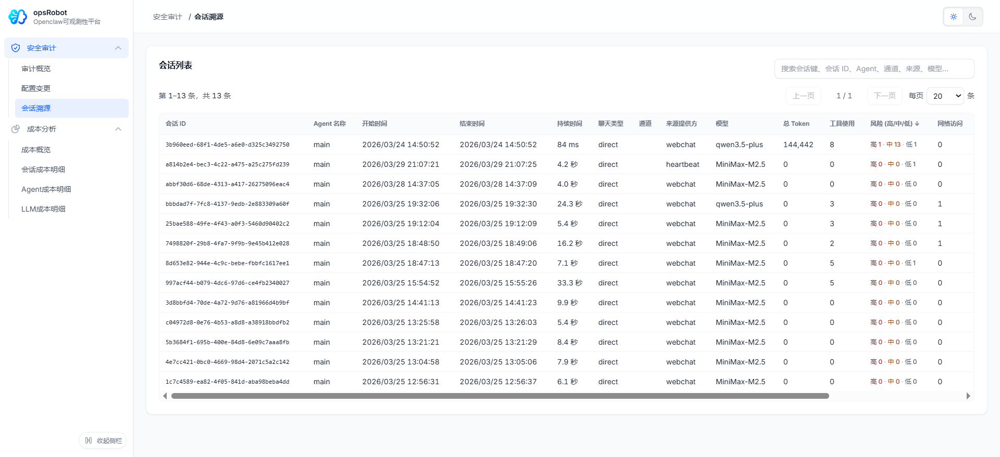
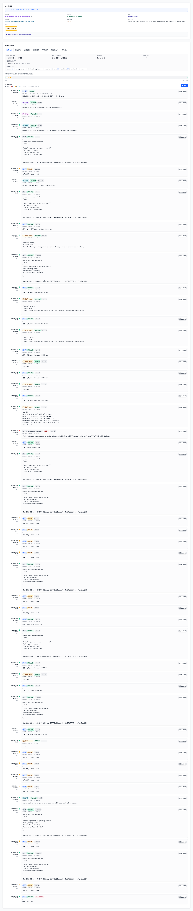
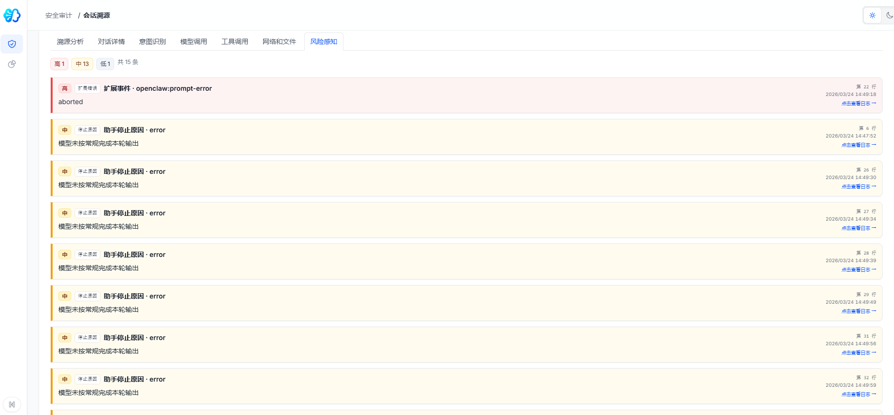

# 会话审计与溯源追踪 (Session Tracing)

会话审计与溯源追踪是 OpenClaw 平台的重要模块。它直接分析存储在 Apache Doris 中的流水记录，为管理员和安全团队提供细粒度的会话执行细节。

---

## 🌟 核心价值与功能细节分析

当需要排查数字员工的异常交互（如响应不符预期或未捕获的错误）时，传统的 API 日志通常难以提供足够的上下文。通过会话溯源功能，管理员可以重构 Agent 的完整执行路径，准确还原其规划与工具调用过程。

### 1. 历史审计日志列表与高级过滤
海量的交互文本需要多维度的检索支持。在会话列表区域，您可以全面掌控所有并发或历史对话。

- **核心字段概览**：列表直观呈现会话 ID、所属 Agent（如 `main`）、起始与结束时间、总耗时、聊天类型、接入通道（如 `webchat`）、模型来源及底层模型版本、总 Token 消耗、工具调用次数、以及网络访问统计等。
- **混合条件过滤**：支持指定模型、会话 ID、Agent 名称、触发终端等多条件组合筛选，快速定位特定时间段内的交互。
- **红绿灯风险标识**：列表中即时展示该会话命中的高/中/低危安全策略次数（如 `高1·中13`）。
- **行内展开**：点击列表右侧按钮，可快速预览该会话的最新交互明细及高危操作标记，无需跳转详情页即可掌握概况。

### 2. 多维度全链路溯源分析 (Tracing Analysis)
选中特定会话后，系统进入专属的全链路溯源页面，提供由浅入深的侦测模块（可通过顶部 Tab 自由切换）：

**溯源分析 (Trace Details)**
按时间线（精确至毫秒）自上而下呈现代码级的执行过程，重构数字员工发起的每一个底层子动作。

管理员借此能够追踪：
- **节点间时间差**：如从 Prompt 开始到工具唤醒经过了多少毫秒（`+2 ms`、`+20 ms`）。
- **进程树结构**：基于 `parentId`，明确哪些工具调用是由特定的思维链扩展衍生而来。
- **输入输出流**：不仅展示成功的回包，同时保留工具执行过程中产生的 `stderr` 报错及控制台原文。

**丰富的专项分析面板**
除了完整的溯源时间线，该页面亦分类拆解特定维度的审计数据：
- **对话详情**：直观展示提问与 LLM 输出内容，便于非技术人员阅读。
- **意图识别 / 模型调用**：展示底层 LLM 请求中携带的系统预设以及路由分析结果。
- **工具调用 / 网络和文件**：将针对宿主机的侵入性操作（如 Shell 命令执行、`fs` 文件读取、外网 HTTP 拦截）单独提纯。

### 3. 可视化报错与安全感知 (Risk Nodes Isolation)
为了协助安全团队在长上下文中快速定位异常节点，平台集成了独立的「风险感知」雷达屏：

- **高亮诊断定位**：系统筛选出含有特定标准错误（如 `error`, `aborted`, `prompt-error`）的输出。
- **自动化定级**：
  - `🔴 高风险`：例如代码层面的执行阶段终端、非预期的核心服务崩溃。
  - `🟡 中风险`：例如模型未按常规格式完成本轮输出（解析失败）、特定工具调用出错要求系统重试。
- **错误快照关联**：可以直接点击“点击查看日志”，系统将快速跳转至海量溯源行中的案发源头，帮助专家一键还原错误现场。

---

> **最佳实践 (Best Practice) 👉 复盘异常 Token 消耗**
> 建议定期抽查 Token 消耗较高且响应未达预期的任务，通过流水线回放，排查系统 Prompt 在特定边界条件下是否存在反复调用却无法得出有效结果的逻辑缺陷。
