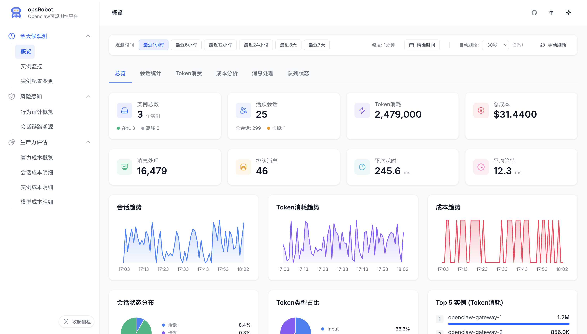
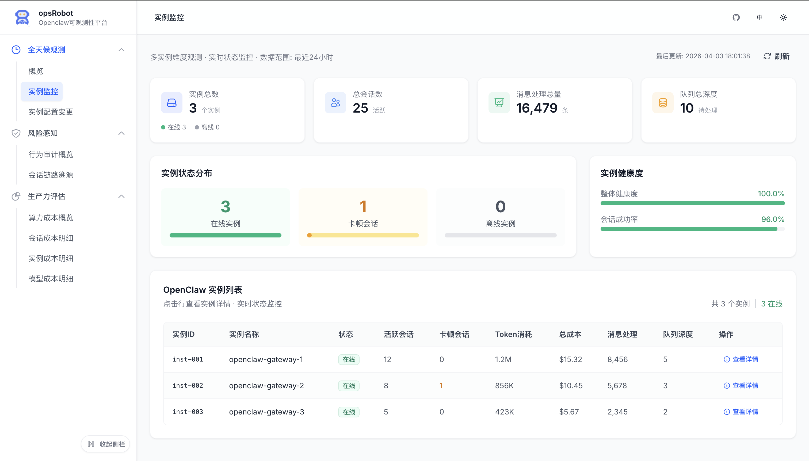
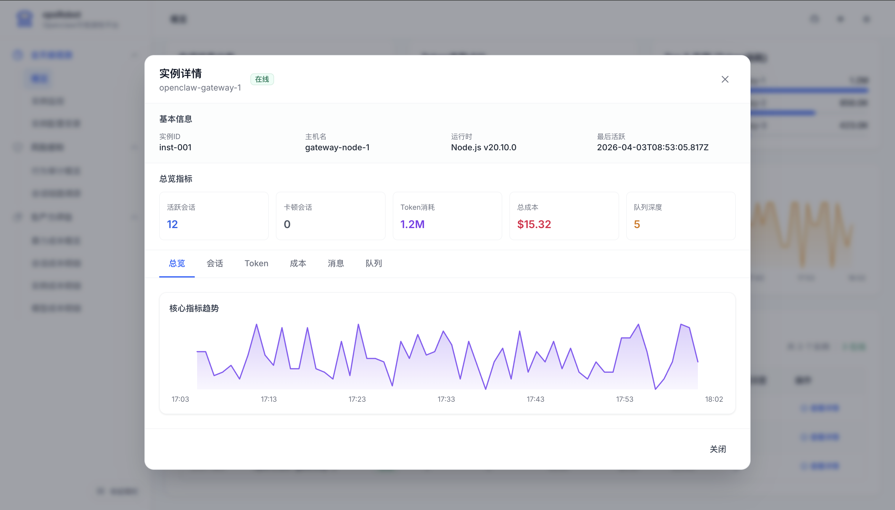
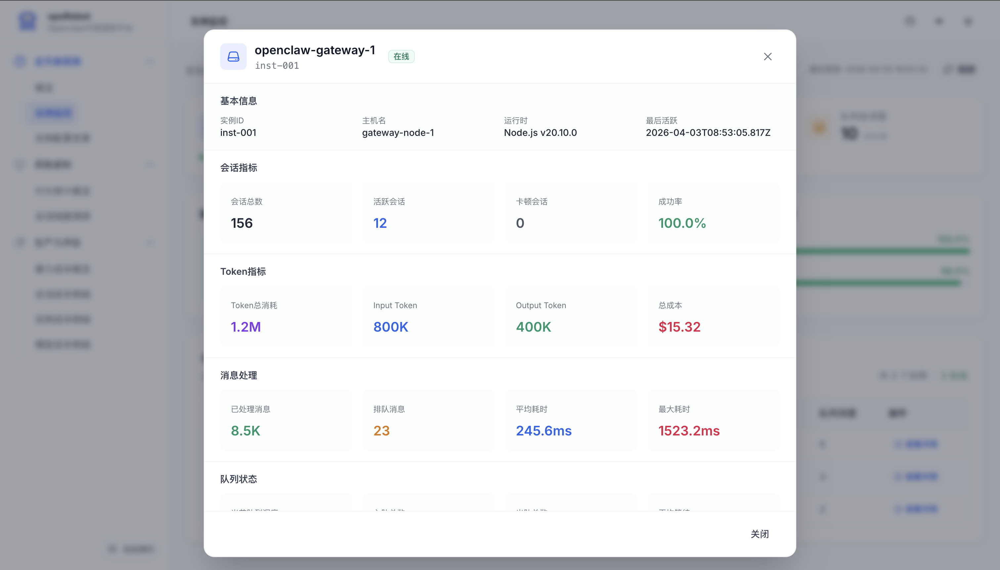

# 系统概览与实例监控 (System Monitoring)

在多节点或高并发的大模型业务中，保障底层接入网关与代理实例的健康状态是运维的核心目标。「全天候观测」模块为平台提供了基础设施级的实时监控，确保所有的 AI 会话都能被平稳、低延迟地处理。

---

## 🌟 核心价值

此模块填补了业务和底层之间的监控真空，使得运维团队不仅能追踪到单个数字员工做了什么，还能宏观地掌握所有承载它们运行的物理/虚拟实例（Instances）的工作状态、处理吞吐量及健康度。

## 📸 功能详解

### 1. 全局系统概览 (Global Overview)
整个观测平台的实时大屏入口，综合汇聚了系统的运行全貌，提供细粒度至分钟级的刷新：

- **综合大盘指标**：一屏统揽运行中的实例总数、当前活跃会话、以及累计的 Token 消耗与核算总成本。
- **性能与吞吐监控**：实时展示“消息处理总量”、“排队消息数”以及平均消息耗时和等待时延（如 `245.6 ms` 处理时延），这是预防系统雪崩的重要指标。
- **高密度可视化趋势**：包含多张精美卡片集，展示会话并发趋势、Token类型输入/输出结构占比，以及 Token 消耗最高的 Top 5 实例排名，帮助团队直观识别性能瓶颈。

### 2. 实例级状态监控 (Instance Monitoring)
针对分布式部署场景，将大盘数据下钻至具体的运行节点（如 `openclaw-gateway-1`）：

- **健康度与成功率**：整体健康状态打分体系，结合会话成功率（如 `96.0%`），迅速发现是否存在区域性的网络异常或模型阻断。
- **卡顿拦截指标**：专门统计处于卡顿或死锁的异常会话（Stalled Sessions），指引管理员及时介入干预。
- **下钻实例明细列表**：通过表格统管所有在线节点，清晰比对每个 Instance 承载的并发量、处理堆积和总体消费额。

### 3. 多维实例详情页 (Instance Details Modal)
对于存在风险或高负载的单一实例，提供基于弹窗的重度下钻分析：

- **运行环境捕获**：系统精准采集实例的主机名（Hostname）及运行时环境架构（如 `Node.js v20.10.0`），便于排查环境兼容性。
- **细粒度微端聚合**：支持再次下切，分别从“会话”、“Token”、“成本”、“消息”、“队列”这五大维度查看这单个容器节点独享的数据报表与波动走势。
- **处理极值追踪**：单独剥离出“最大耗时”（Max Latency，如 `1523.2ms`），为解决长尾性能问题提供突破口。

---

> **最佳实践 (Best Practice) 👉 设置合理的队列深度告警**
> 若「排队消息数」持续处于高位，且实例健康度面板中的「最高耗时」飙升，说明部分大模型提供商的接口响应出现阻塞。建议尽早配合配置变更为该节点启用自动降级或负载切换策略。
