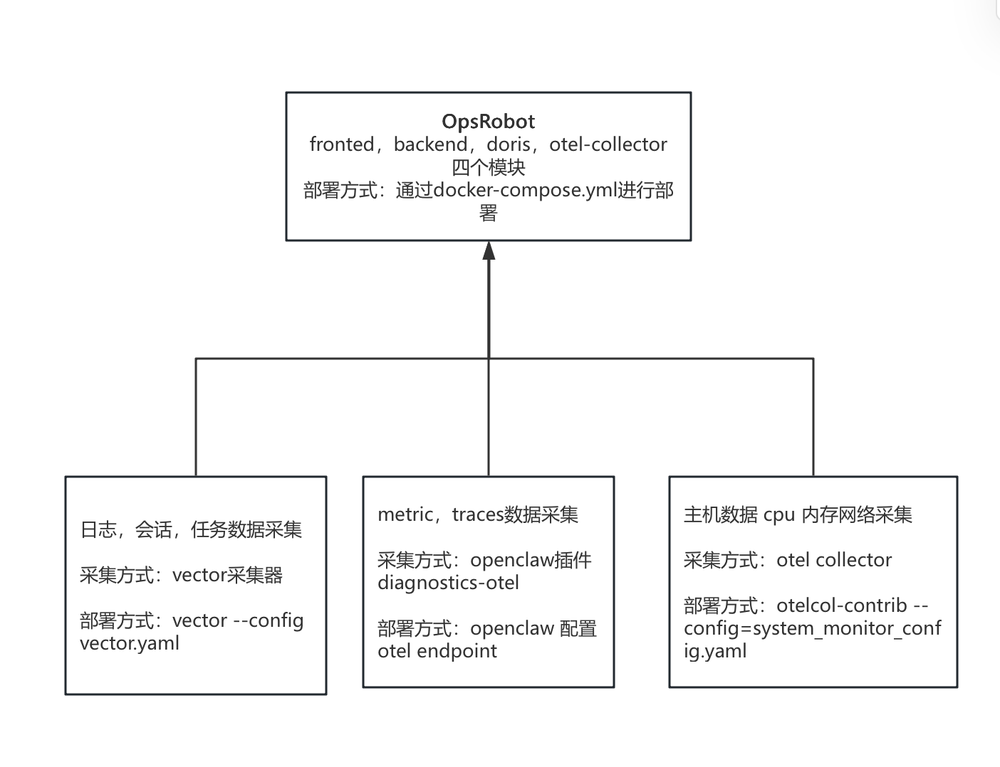

# 快速起步：本地运行与预览

本指南将协助您在本地环境中快速启动 OpenClaw Observability Platform，以便预览界面与基础分析功能。

---

## 📋 前提条件


- **Docker** 引擎与 **Docker Compose** 插件：用于启动作为数据中枢的 Apache Doris 数据库。
- *(可选)* **Vector**: 若需从本地真实应用节点收集日志则需安装。仅体验控制台界面可跳过此步。

---

## 快速开始

### 1.部署总览
部署总览：


### 1.环境要求

#### 软件要求

- Docker Desktop 及 Docker Compose 插件

#### 硬件配置要求

为确保系统稳定运行,建议的硬件配置如下:

| 资源类型 | 最低配置 | 推荐配置 | 说明 |
|---------|---------|---------|------|
| **CPU** | 2 核 | 4 核+ | Apache Doris 数据库对计算资源需求较高 |
| **内存** | 8 GB | 16 GB+ | Docker 容器内存限制为 Doris 分配 8GB |
| **磁盘** | 20 GB | 50 GB+ | 日志数据和观测数据会持续占用存储空间 |
| **网络** | 100 Mbps | 1 Gbps | 数据采集和查询的网络带宽需求 |

**组件资源分配详情:**

- **Frontend (前端服务)**: 轻量级静态文件服务,资源消耗较低
- **Backend (后端 API)**: Node.js 服务,默认端口 8787,中等资源消耗
- **Apache Doris (数据库)**:
  - 生产环境推荐: 4 核 CPU / 16 GB 内存
  - 开发测试环境: 2 核 CPU / 8 GB 内存 (默认配置)
  - 支持 MySQL 协议端口: 9030
  - HTTP API 端口: 8030 (FE) / 8040 (BE)
- **Vector (数据采集器)**: 轻量级采集代理,资源消耗较低

> **注意**: 如果您的系统内存不足 8GB,可以通过修改 `docker-compose.yml` 文件中的 `deploy.resources` 配置来降低 Doris 的内存限制,但可能会影响查询性能。

### 2.克隆项目

```bash
https://github.com/opsrobot-ai/opsrobot.git
cd opsrobot
```

### 3.基于镜像部署后台服务

```bash
docker compose -f docker-compose.yml up -d
```

服务启动后访问：http://localhost:3000


### 4.配置 OpenClaw 数据采集

**说明：在每个 OpenClaw 运行的机器上安装配置采集器vector**
[vector官网](https://vector.dev/docs/)  [vector 安装说明](https://vector.dev/docs/setup/installation/)

#### MacOS 环境的采集器安装：

```bash
brew tap vectordotdev/brew && brew install vector
```

#### Linux 环境的采集器安装：

CentOS 系统使用 yum 命令安装：
```bash
bash -c "$(curl -L https://setup.vector.dev)"
sudo yum install vector
```

Ubuntu 系统使用 apt-get 命令安装：
```bash
bash -c "$(curl -L https://setup.vector.dev)"
sudo apt-get install vector
```

#### 修改 `vector.yaml` 采集配置文件：
[vector配置文档](https://vector.dev/docs/reference/configuration/)
指向后端服务器 IP 地址（如果与 OpenClaw 在同一台服务中，无需修改）：
```yaml
sinks:
  session_to_doris: &sink_template
    uri: "http://127.0.0.1:8040/api/opsRobot/agent_sessions/_stream_load"

  session_logs_to_doris:
    uri: "http://127.0.0.1:8040/api/opsRobot/agent_sessions_logs/_stream_load"

  gateway_logs_to_doris:
    uri: "http://127.0.0.1:8040/api/opsRobot/gateway_logs/_stream_load"

  audit_logs_to_doris:
    uri: "http://127.0.0.1:8040/api/opsRobot/audit_logs/_stream_load"

  openclaw_config_to_doris:
    uri: "http://127.0.0.1:8040/api/opsRobot/openclaw_config/_stream_load"

  agent_models_to_doris:
    uri: "http://127.0.0.1:8040/api/opsRobot/agent_models/_stream_load"

```

指向实际的 OpenClaw 日志目录，实现日志采集监听：
```yaml
sources:
  sessions:
    command: 
      - "sh"
      - "-c"
      - 'for f in ~/.openclaw/agents/*/sessions/sessions.json; do if [ -f "$$f" ]; then tr -d "\n" < "$$f"; echo ""; fi; done'

  session_logs:
    include:
      - "~/.openclaw/agents/*/sessions/*.jsonl"

  gateway_logs:
    include:
      - "~/.openclaw/logs/gateway.log"
      - "~/.openclaw/logs/gateway.err.log"

  audit_logs:
    include:
      - "~/.openclaw/logs/config-audit.jsonl"

  openclaw_config_file:
    command:
    - "sh"
    - "-c"
    - 'f="~/.openclaw/openclaw.json"; if [ -f "$$f" ]; then j=$$(tr -d "\n" < "$$f"); printf "{\"source_path\":\"%s\",\"openclaw_root\":%s}\n" "$$f" "$$j"; fi'

  agent_models_file:
    command:
    - "sh"
    - "-c"
    - 'for f in ~/.openclaw/agents/*/agent/models.json; do if [ -f "$$f" ]; then agent=$$(basename "$$(dirname "$$(dirname "$$f")")"); [ -z "$$agent" ] && continue; j=$$(tr -d "\n" < "$$f"); printf "{\"source_path\":\"%s\",\"agent_name\":\"%s\",\"models_root\":%s}\n" "$$f" "$$agent" "$$j"; fi; done'

  cron_jobs_config_file:
    type: exec
    command: 
      - "sh"
      - "-c"
      - 'for f in ~/.openclaw/cron/jobs.json; do if [ -f "$$f" ]; then tr -d "\n" < "$$f"; echo ""; fi; done'

  cron_runs_config_file:
    type: file
    include:
    - "~/.openclaw/cron/runs/*.jsonl"
    read_from: beginning
    fingerprint:
      strategy: device_and_inode
```

#### 启动 Vector 采集器服务：

```bash
vector --config vector.yaml
```
### 5.配置 OpenClaw-Diagnostics-Otel 数据采集

* [官方文档介绍](https://docs.openclaw.ai/zh-CN/logging)

在openclaw.json文件需要增加或者修改配置如下：
```yaml
{
  "diagnostics": {
    "enabled": true,
    "otel": {
      "enabled": true,
      "endpoint": "http://192.168.72.87:4318",
      "traces": true,
      "metrics": true,
      "logs": true,
      "protocol": "http/protobuf",
    },
    "cacheTrace": {
      "enabled": true,
      "includeMessages": true,
      "includePrompt": true,
      "includeSystem": true
    }
  },
  "plugins": {
    "entries": {
      "diagnostics-otel": {
        "enabled": true
      },
    },
    "allow": [
      "diagnostics-otel",
    ]
  }
}
```
修改配置完成后，需要 重启openclaw：
```bash
openclaw gataway restart
```


### 6.配置 OpenClaw-主机信息数据采集
根据当前部署openclaw的主机的信息，部署对应版本的数据采集器 https://github.com/open-telemetry/opentelemetry-collector-releases/releases/tag/v0.144.0 , 推荐v0.144.0 版本


```yaml
receivers:
  hostmetrics:
    collection_interval: 10s
    scrapers:
      cpu: {}
      memory: {}
      disk: {}
      filesystem: {}
      network: {}
      load: {}
      processes: {}
      paging: {}    
      process: {}    
      system: {}   

processors:
  batch:
    timeout: 2s

exporters:
  debug:
    verbosity: basic

  doris:
    endpoint: "http://127.0.0.1:8030" # 修改doris数据的部署地址
    mysql_endpoint: "127.0.0.1:9030"  #  修改doris数据的部署地址
    database: "opsRobot"
    table:
      metrics: "host_metrics"
    username: "root"
    password: ""
    create_schema: true

service:
  pipelines:
    metrics:
      receivers: [hostmetrics]
      processors: [batch]
      exporters: [doris, debug]

```

``` bash
otelcol-contrib --config=config.yaml
```

### 7.查看 OpenClaw 的所有观测数据：

* 在 OpenClaw 界面进行对话互动
* 在 opsRobot 产品界面中查看采集数据：https://localhost:3000

**平台已在您的本地就绪！**

阅读建议：
- 参考 [部署与架构拓扑](./deployment.md) 了解生产环境的集成方案。
- 阅读 [功能介绍 - 会话与审计追踪](../features/session-tracing.md) 深入了解业务模块的具体功能。
